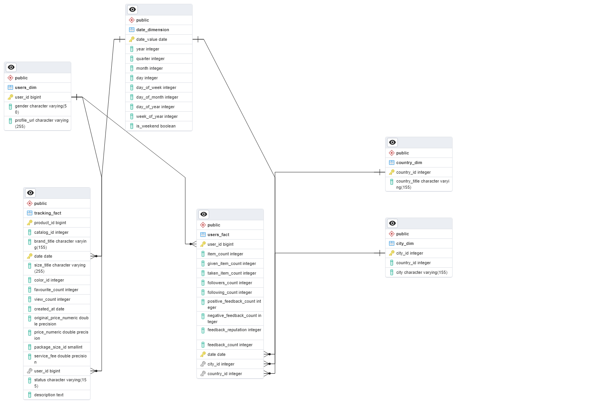

<h3 style="text-align: center;">Vinted Analytics Pipeline</h3>

# Project Overview

Looker Studio: [Daily Snapshot Report](https://lookerstudio.google.com/s/rPPHeQ0OlOk) of the Vinted Pipeline status.
Streamlit: [Dashboard](http://16.171.182.134:8502/)

## DB Design

#### Staging Area

Staging

#### Semi-Normalized Layer (Star Schema powered by DBT)

Star Schema

### Pipeline design

- **Atomicity**: a function should only do one task
- **Idempotency**: 
    - running the same code multiple times with the same input should return the same output
    - the output should not be duplicated
- **Data encapsulation**: function encapsulation should be limited to the scope it refers to, no additional external data.
- **Functional composition**: a higher order mechanism which allows to increase the level of abstraction and atomicity. Can be implemented in prefect via subflow calls.
    - factoring/atomicity
    - code reuse
    - + abstraction layers (f(g(x)))

##### Limitations

- Vinted API endpoints doesn't provide a direct way to get the brands, sizes, colours, gender, and status variables
- Vinted API requests are rate limited

## Roadmap

### Todo Main Features

- [x] Create an API to connect to Vinted Endpoints 
- [x] Create a basic data pipeline with prefect and postgres
- [ ] Documentation
- [x] Refactor tracking flow to schedule multiple subflows and use persistent results
- [ ] Cluster assessment of products in dashboard
- [ ] Use text tokens to predict prices (remove brand names)
- [ ] Cluster brand names by similarity (yeezy/adidas, nike/jordan, etc)

### Backlog

- [x] Work on the dashboard
- [ ] Develop a pipeline to track saleability
- [x] Develop a pipeline to track brand, catalog_id
- [x] Create dim tables for brands, sizes and colours
- [x] Normalize the database
- [x] Find a way to overcome API rate limits (currently implemented Exponential Backoff on requests)

### Looker Studio

