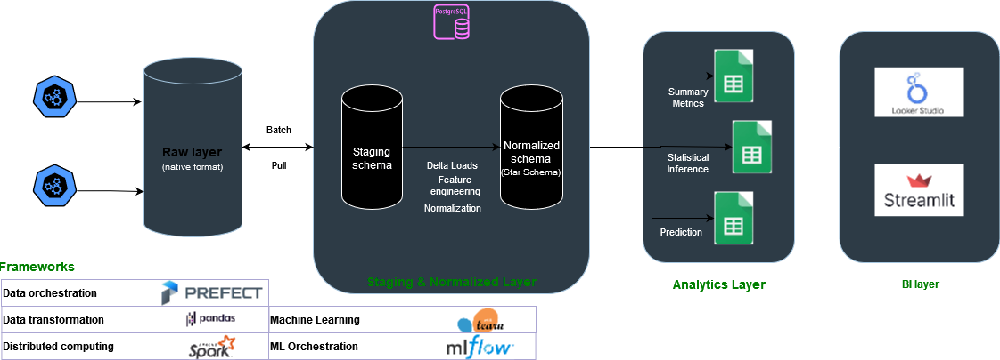
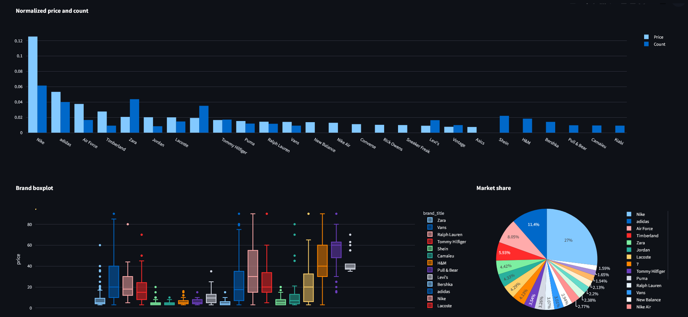
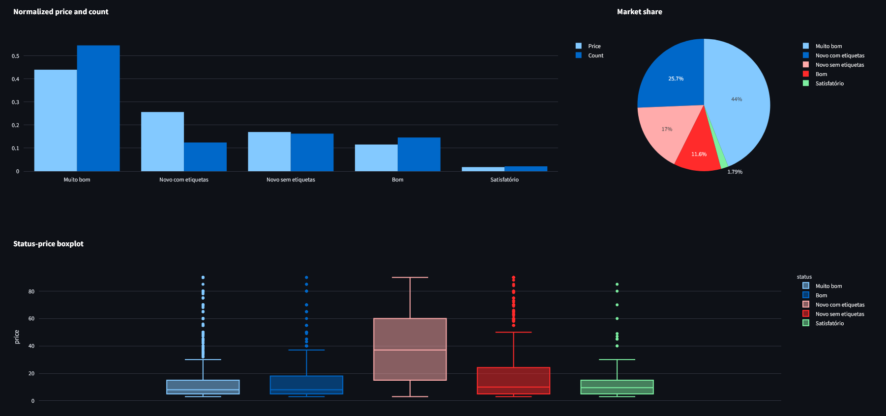
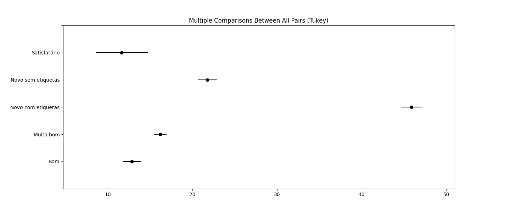
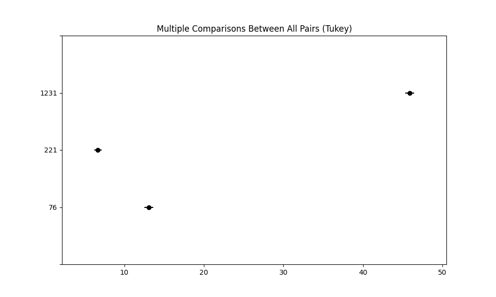
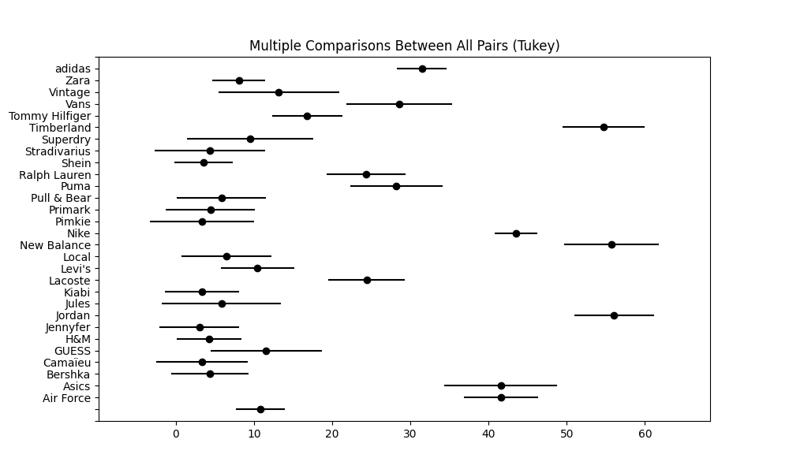
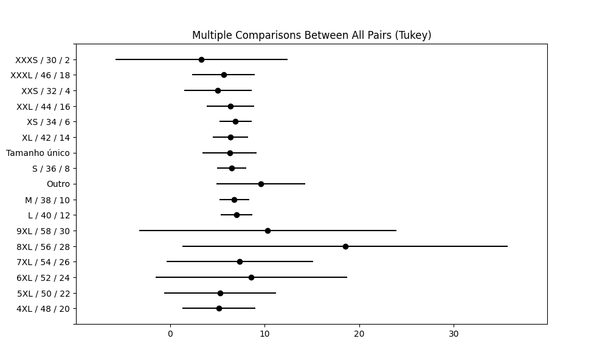
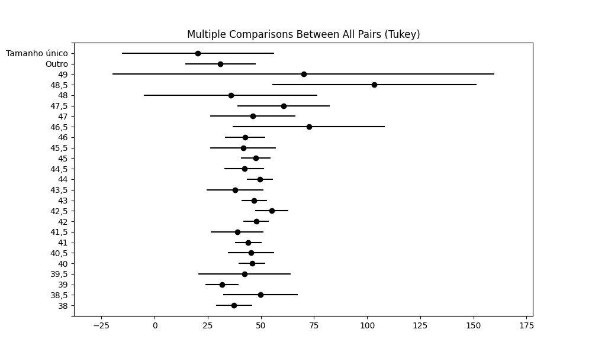
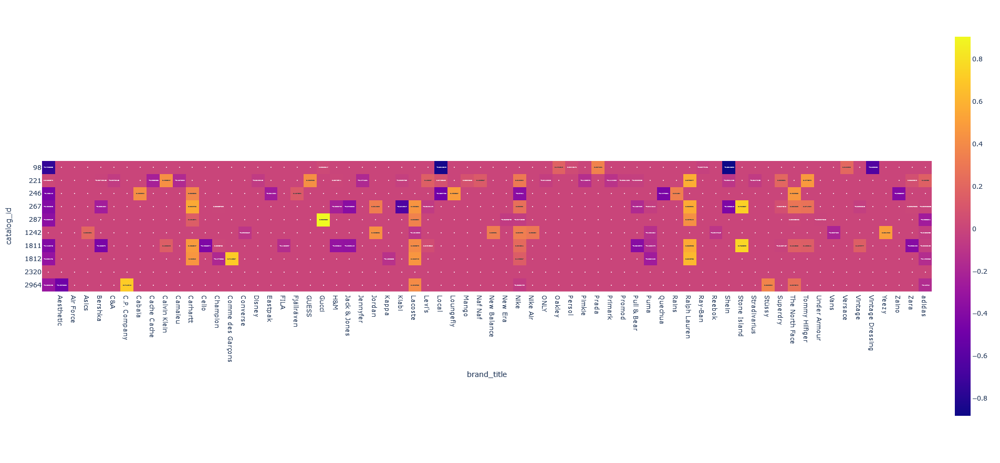
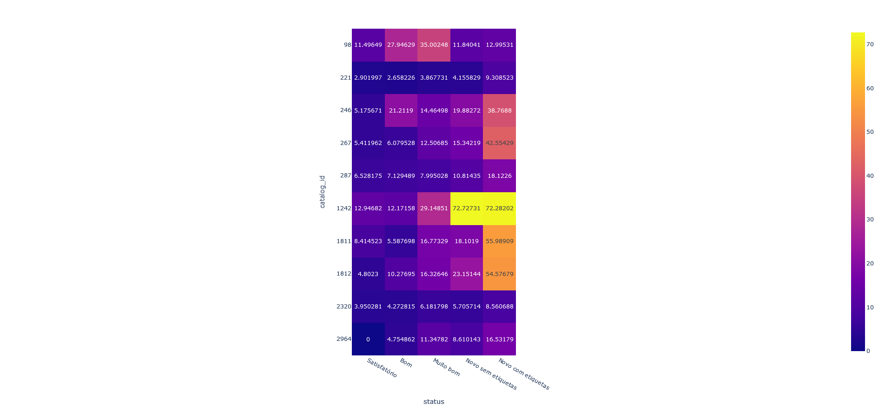

<h3 style="text-align: center;">Vinted Analytics - Analysis of a Blooming Second Hand Marketplace</h3>

# Project Overview

## Intro

According to a report by ThredUp, a leading online resale platform, the resale market is projected to reach $64 billion by 2024, highlighting the growing appeal of pre-owned fashion among consumers. (ThredUp's 2021 Resale Report)

Main market drivers are:
- Changing consumer patterns
- Economic opportunities and affordability
- Circular economy and environmental concerns
- Online platforms such as Vinted, Depop, Poshmar and ThredUp

The purpose of this project is to find key insights about data from Vinted which can help users to determine how to best sell their products. Some concerns users face when selling articles are:

## Business Case Study

Each platform has its own market dynamics, I will focus on the selling dynamics. In order to maximize profit, these are some questions we are aiming to answer:

-  ([Which are the most profitable product categories?](#Profitable-product-categories))
- Which are the most profitable brands?
- What is the premium attributed to each different status?
- What is the expected selling price for each prouct category?
- Are there arbitrage opportunities in iliquid products markets?
- Maximizing product exposure
    - Improving Vinted SEO by including keywords in the description
    - Improving Vinted SEO by generate product description using parameterized LLM queries
    - Improving Vinted SEO by creating advertisements in the hours with biggest user flow
- What is the best product mix (Product Bundling Design)
    - Which products are complementary

##### Limitations

- Vinted only provides the 
- Vinted API endpoints doesn't provide a direct way to get the brands, sizes, colours, gender, and status variables
- Vinted API frequests are rate limited

##### Other

- Tracking data drift by monitoring flow metadata and Kullback-Leibler Divergence (difference between distributions accross timeframes)
    -> Tracking proportions in categorical variables
    -> Tracking KL divergence for numerical variables
- Price sensitivity to item condition per catalog

## Roadmap

### Todo Main Features

- [x] Create an API to connect to Vinted Endpoints 
- [x] Create a basic data pipeline with prefect and postgres
- [ ] Documentation
- [x] Refactor tracking flow to schedule multiple subflows and use persistent results
- [ ] Cluster assessment of products in dashboard
- [ ] Use text tokens to predict prices (remove brand names)
- [ ] Cluster brand names by similarity (yeezy/adidas, nike/jordan, etc)

### Backlog

- [x] Work on the dashboard
- [ ] Develop a pipeline to track saleability
- [x] Develop a pipeline to track brand, catalog_id
- [x] Create dim tables for brands, sizes and colours
- [x] Normalize the database
- [x] Find a way to overcome API rate limits (currently implemented Exponential Backoff on requests)

## Dashboard

Currently just a few descriptive simple graphs. No callback functions.

### Looker Studio

[Daily Snapshot Report](https://lookerstudio.google.com/s/rPPHeQ0OlOk) of the Vinted Pipeline status.

### Streamlit

** Brands **

** Status **

## Exploration

### How article status conditions price

Tukey HSD is often used as an extension of ANOVA (post-hoc test) to compare means between 2 groups. Caveat: does not take into account covariates (the effects of labels)
There is a significant difference between all groups except Bom Satisfatório. Makes sense to do HSD test per catalog.

**Tukeys HSD test**

| group1                  | group2                  | meandiff | p-adj | lower  | upper  | reject |
|-------------------------|-------------------------|----------|-------|--------|--------|--------|
| Bom                     | Muito bom               | 3.3741   | 0.0   | 1.6412 | 5.107  | True   |
| Bom                     | Novo com etiquetas      | 33.0584  | 0.0   | 30.7484| 35.3684| True   |
| Bom                     | Novo sem etiquetas      | 8.9344   | 0.0   | 6.7008 | 11.1679| True   |
| Bom                     | Satisfatório            | -1.1909  | 0.9339| -5.3086| 2.9269 | False  |
| Muito bom               | Novo com etiquetas      | 29.6843  | 0.0   | 27.7227| 31.646 | True   |
| Muito bom               | Novo sem etiquetas      | 5.5603   | 0.0   | 3.6893 | 7.4313 | True   |
| Muito bom               | Satisfatório            | -4.565   | 0.0134| -8.4979| -0.632 | True   |
| Novo com etiquetas      | Novo sem etiquetas      | -24.124  | 0.0   |-26.5394|-21.7087| True   |
| Novo com etiquetas      | Satisfatório            | -34.2493 | 0.0   |-38.4684|-30.0302| True   |
| Novo sem etiquetas      | Satisfatório            | -10.1253 | 0.0   |-14.303 |-5.9475| True   |

**Marginal gains:**

Bom -> Muito Bom = 3.4€ avg
Muito Bom -> Novo sem etiquetas = 5.5€
Nove sem etiquetas -> Novo com etiquetas = 24.1€

### How article catalog conditions price

**Tukeys HSD test**

| group1 | group2 | meandiff | p-adj | lower  | upper  | reject |
|--------|--------|----------|-------|--------|--------|--------|
|   76   |   221  |  -6.3822  |  0.0  | -7.4262| -5.3383|  True  |
|   76   |  1231  |  32.8322  |  0.0  | 31.7076| 33.9568|  True  |
|  221   |  1231  |  39.2144  |  0.0  | 38.1552| 40.2736|  True  |

**Difference between labels:**

76 (t shirts) -> 221 (women t shirts) = -6.4€ avg
76 (t shirts) -> 1231 (sneakers) = 33€
221 (women t shirts) -> 1231 (sneakers) = 39.2€

### How brand price conditions price (top 30 brands by listing frequency)

It's clear there are underlying covariate which explain the deviations between brands. For instance, knowing Timberland, New Balance and Jordan are mostly sneakers brands and sneakers have huge margins on other types of catalog items is very important to understand the deviations. This further emphasis the importance of domain knowledge in data science.

### How sizes condition price

#### Clothing

#### Shoes

## Business Questions

#### Profitable product categories

I get it. This isn't an answer, yet this gives me lots of insights. Product categories is the first hierarchical step in finding profitable solutions.

- Category 1242 (Trainers) is a good category to sell only if you have an interesting article (positive skewness, low kurtosis)
- Category 221 is very hard to sell at Q2-Q3 prices (high positive skewness and high kurtosis)
- Category 267 (hoodies and sweaters) and 246 (backpacks) are solid choices
- Category 1806 (plain t shirts) is okay.
- Category 1812 (zip through hoodies) is very similar to 267. Solid choice

| category |        Q1   |      Q2    |     Q3     |  Skew    |  Kurt    |
|------|------------|------------|------------|----------|----------|
|  98  | 10.389857  | 16.110513  | 38.293716  | 0.737483 | -0.874382|
| 221  |  1.524014  |  6.018118  | 14.789115  | 1.760902 |  2.641145|
| 246  | 10.099439  | 16.023626  | 23.070975  | 1.224792 |  1.111381|
| 267  | 10.726804  | 17.536312  | 27.079664  | 1.185220 |  0.463275|
| 287  |  7.140100  | 10.705651  | 18.712344  | 0.874319 | -0.001482|
|1242  | 19.734483  | 32.797541  | 39.949489  | 0.200186 | -0.517726|
|1806  |  7.079202  | 11.307161  | 20.009727  | 1.202363 |  0.843266|
|1811  |  9.258806  | 17.562339  | 23.618220  | 0.489223 | -0.249335|
|1812  |  5.240637  | 17.903996  | 35.676559  | 0.680350 | -0.854602|
|2320  |  2.633426  |  6.583752  | 10.818358  | 1.003392 |  0.535164|
|2964  |  2.949773  |  7.337360  | 15.471069  | 1.589517 |  2.171635|

#### Brands premium per category

**Assumption**: a brand is only premium in relation to a specific market segment (ex. Ralph Lauren is a luxury good for clothes but not for sneakers)

#### Status premium

**Assumption**: specific products are highly sensitive to product status (ex. Sneakers)

